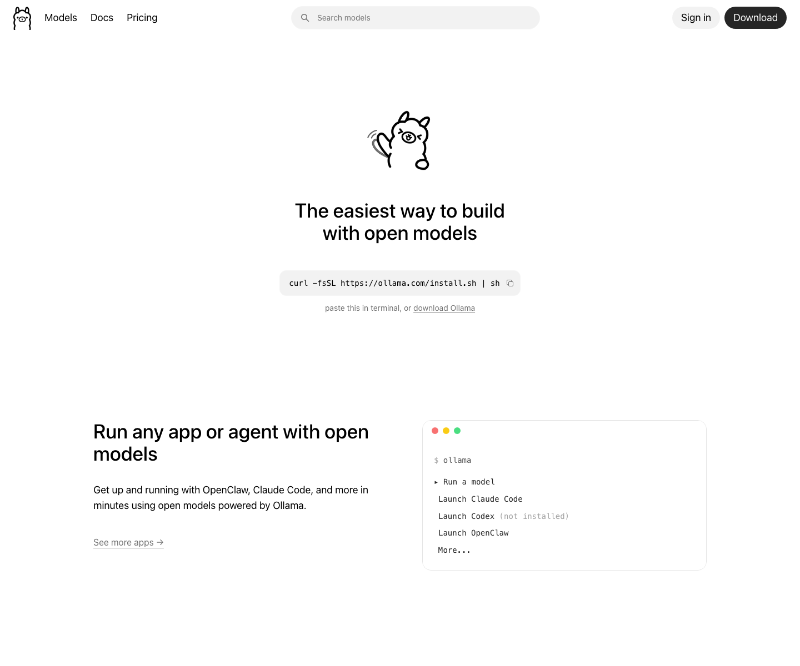
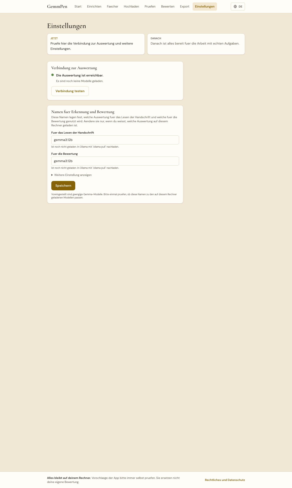
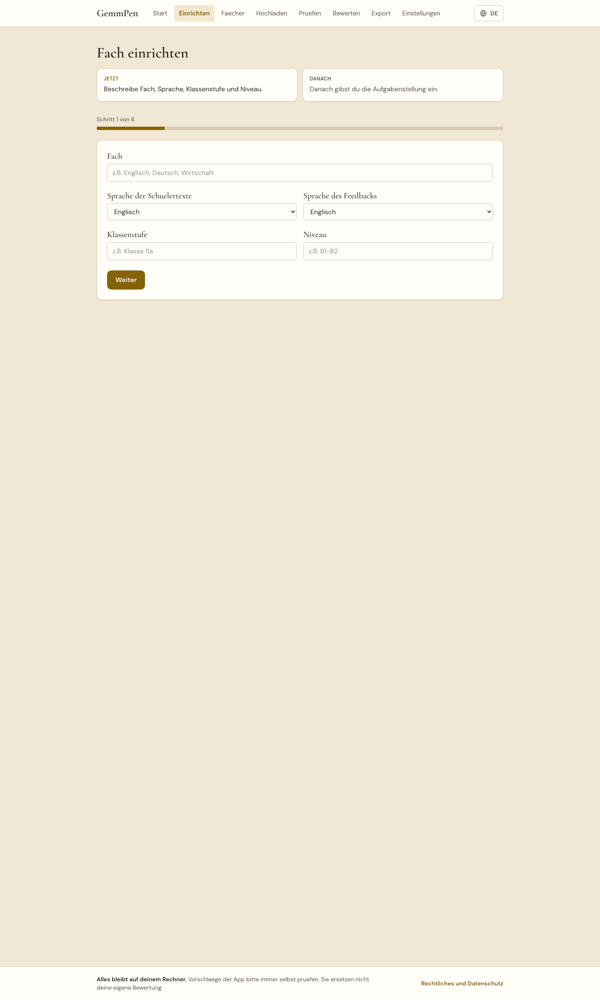
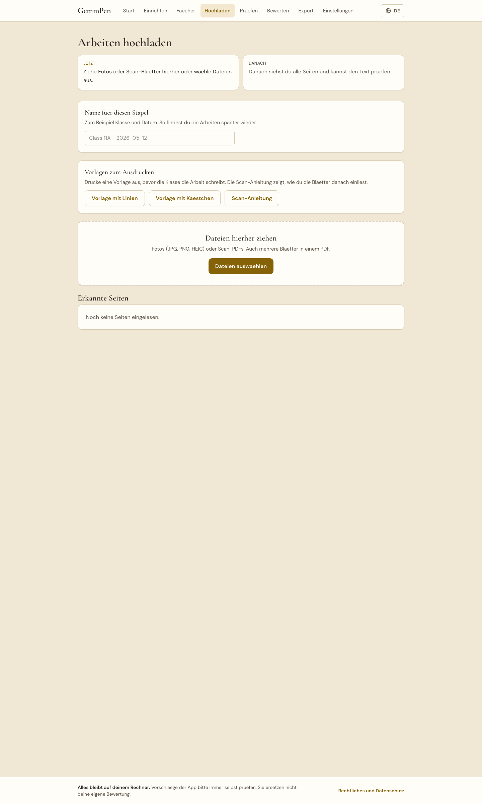
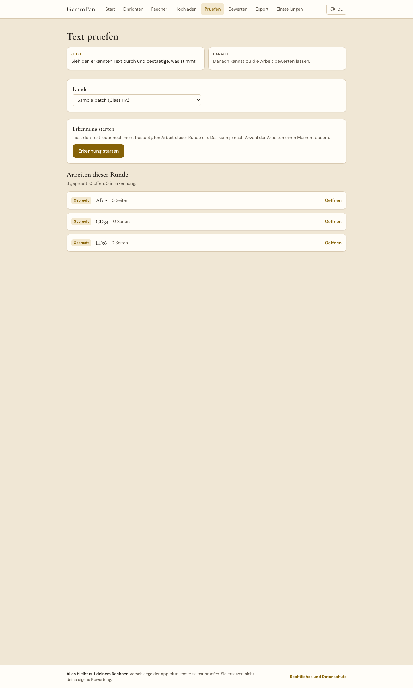
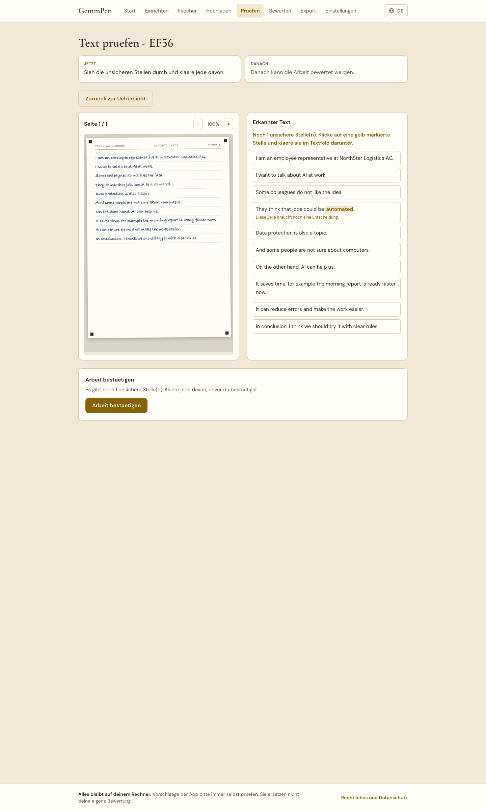
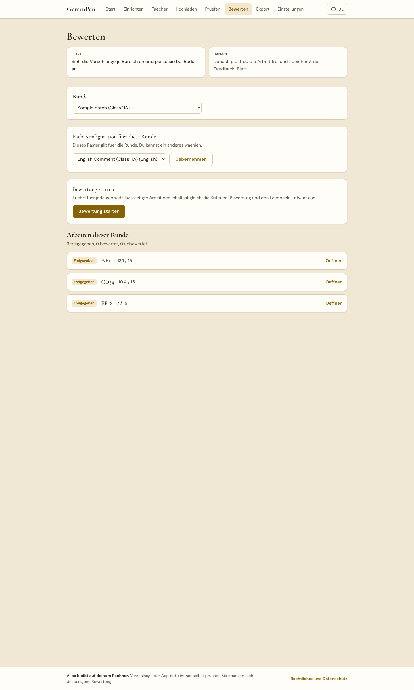
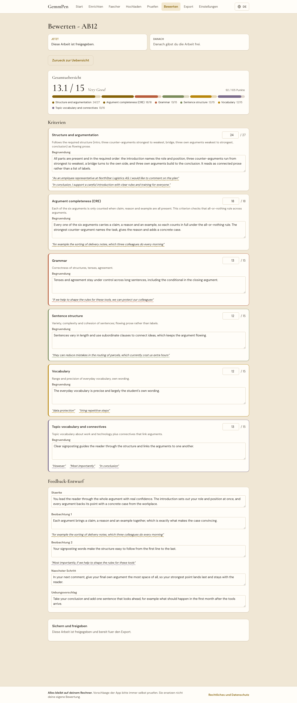
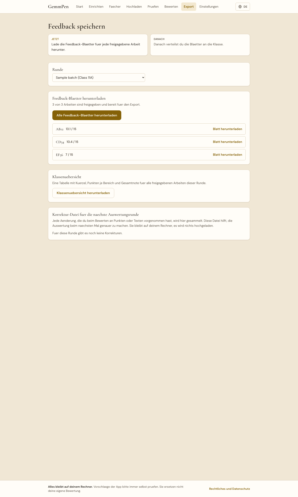

# Erste Schritte mit GemmPen Teacher

Diese Anleitung zeigt dir den ganzen Weg: vom ersten Start bis zum fertigen Feedback-Blatt fuer eine Schuelerin oder einen Schueler. Du brauchst keine Vorkenntnisse. Nimm dir beim ersten Mal etwas Zeit, vor allem fuer den einmaligen Download der Auswertung.

## Was du vorher brauchst

- Einen Rechner (Mac oder Windows), auf dem du das Programm dauerhaft installiert lassen kannst.
- Internet fuer die einmalige Einrichtung. Danach funktioniert GemmPen Teacher auch ohne Internet.
- Etwa 10 bis 20 Minuten Geduld beim allerersten Start, weil einmalig ein groesseres Paket heruntergeladen wird.
- Ollama. Das ist das Programm, das im Hintergrund die Handschrift liest und die Bewertung erstellt. Du musst es nur einmal installieren, siehe Schritt 1.

## Schritt 1: Ollama installieren

Lade Ollama von [ollama.com](https://ollama.com) herunter und installiere es wie jedes andere Programm. Das machst du nur einmal. GemmPen Teacher braucht Ollama, um Handschrift zu lesen und Arbeiten zu bewerten.

## Schritt 2: GemmPen Teacher starten

Oeffne den Ordner mit GemmPen Teacher. Darin liegt ein Ordner `install`. Doppelklicke dort auf die Datei fuer dein Betriebssystem:

- Mac: `start-mac.command`
- Windows: `start-windows.bat`

[SCREENSHOT: Ordner install mit den beiden Startdateien]

### Beim ersten Mal: dein Rechner zeigt vielleicht eine Sicherheitsmeldung

Weil GemmPen Teacher ein kleines, kostenloses Programm ist und nicht aus einem grossen App-Store kommt, zeigen Mac und Windows beim allerersten Oeffnen der Startdatei einmalig eine Sicherheitswarnung. Diese Meldung kommt vom Betriebssystem, nicht von GemmPen Teacher, deshalb sagt sie dir auch nicht, wie es weitergeht. Bei dieser Art Programm ist das normal. So kommst du sicher daran vorbei.

**Auf dem Mac.** Wenn "kann nicht geoeffnet werden, da es von einem nicht verifizierten Entwickler stammt" erscheint (oder "Apple kann nicht ueberpruefen ..."), klicke nicht auf "Abbrechen" oder "In den Papierkorb". Stattdessen:

1. Schliesse die Meldung.
2. Halte im Ordner `install` die Taste "ctrl" (Control) gedrueckt und klicke einmal auf `start-mac.command` (oder mach einen Rechtsklick darauf).
3. Waehle im kleinen Menue "Oeffnen".
4. Dieselbe Meldung erscheint noch einmal, jetzt aber mit einem Knopf "Oeffnen". Klicke auf "Oeffnen". Das machst du nur einmal. Jeder weitere Start ist ein ganz normaler Doppelklick.

[SCREENSHOT: Mac-Sicherheitsmeldung mit dem Knopf Oeffnen]

**Auf Windows.** Wenn ein blaues Fenster "Der Computer wurde durch Windows geschuetzt" erscheint:

1. Klicke auf den kleinen Text "Weitere Informationen".
2. Unten erscheint ein Knopf "Trotzdem ausfuehren". Klicke darauf.
3. Das machst du nur einmal.

[SCREENSHOT: Windows-SmartScreen mit Weitere Informationen und Trotzdem ausfuehren]

Fragt dein Rechner zusaetzlich, ob Node.js oder Ollama Aenderungen vornehmen duerfen, gehoert das zu deren eigener Installation und du kannst es erlauben.

Das Startfenster prueft jetzt der Reihe nach:

1. Ob Node.js vorhanden ist. Falls nicht, bekommst du einen Link zum Nachinstallieren.
2. Ob Ollama vorhanden ist. Falls nicht, bekommst du einen Link zu ollama.com.
3. Ob Ollama gerade laeuft. Falls nicht, startet das Skript es automatisch.
4. Ob die benoetigte Auswertung schon heruntergeladen ist. Falls nicht, beginnt jetzt der Download. Das kann beim allerersten Mal 10 bis 20 Minuten dauern. Lass das Fenster in dieser Zeit einfach offen.
5. Ob alle Bausteine der App installiert sind. Beim ersten Start dauert das etwas.
6. Danach startet die App und oeffnet sich automatisch im Browser unter `localhost:3000`.

[SCREENSHOT: Startfenster waehrend des Downloads der Auswertung]

Bleibt irgendwo eine Meldung stehen, sagt sie dir immer, was zu tun ist. Es gibt keinen stillen Abbruch. Beim zweiten Start geht alles deutlich schneller, weil Download und Installation dann schon erledigt sind.

## Schritt 3: Einstellungen pruefen

Klicke in der Navigation oben auf "Einstellungen". Hier siehst du, ob die Auswertung erreichbar ist.

- Ein gruener Hinweis "Die Auswertung ist erreichbar" bedeutet: alles bereit.
- Steht dort "Die Auswertung ist nicht erreichbar", pruefe, ob Ollama laeuft, und klicke auf "Verbindung testen".
- Darunter siehst du zwei Namen: einen "Fuer das Lesen der Handschrift" und einen "Fuer die Bewertung". Diese sind voreingestellt. Aendere sie nur, wenn du weisst, welche Auswertung auf deinem Rechner geladen ist.

## Schritt 4: Ein Fach einrichten

Klicke auf "Einrichten". Ein Assistent fuehrt dich in sechs Schritten durch die Einrichtung: Fach und Rahmen, Aufgabenstellung, Erwartungshorizont und Bewertungsraster, Notensystem und Feedback-Stil, optional Beispielarbeiten, und zum Schluss eine Zusammenfassung.

Eine ausfuehrliche Anleitung dazu findest du in `MEIN-FACH-EINRICHTEN.md`. Am Ende speicherst du die Konfiguration. Sie erscheint danach unter "Faecher".

## Schritt 5: Vorlage drucken

Klicke auf "Faecher" oder oeffne den Ordner `public/templates`. Dort liegen zwei druckfertige Vorlagen (eine mit Linien, eine mit Kaestchen) und eine Scan-Anleitung fuer die Klasse.

Drucke die passende Vorlage fuer jede Schuelerin und jeden Schueler aus. Achte im Druckdialog darauf, dass **100 Prozent Skalierung** eingestellt ist und **"An Seite anpassen" ausgeschaltet** ist. Sonst stimmen die Eckmarker nicht mehr und die spaetere Erkennung wird ungenauer.

[SCREENSHOT: Ausgedruckte Vorlage mit den vier Eckmarkern]

## Schritt 6: Arbeiten schreiben lassen und einsammeln

Die Klasse schreibt auf der ausgedruckten Vorlage. Kopfzeile ausfuellen: Aufgaben-Code und Schueler-Kuerzel (kein Name, siehe `DATENSCHUTZ.md`). Danach:

- **Handyfoto**: das ganze Blatt parallel und bei gutem Licht fotografieren, alle vier Eckmarker muessen sichtbar sein.
- **Scanner**: mit der Scanfunktion des Druckers einscannen, 300 dpi, als PDF speichern. Mehrere Blaetter im Stapeleinzug sind erlaubt, auch von verschiedenen Schuelerinnen und Schuelern.

Die Scan-Anleitung (`scan-anleitung.pdf`) erklaert beide Wege noch einmal in einfachen Worten, falls du sie an die Klasse weitergeben willst.

## Schritt 7: Hochladen

Klicke auf "Hochladen". Gib der Runde einen Namen (zum Beispiel "Klasse 11a - 2026-05-12"). Ziehe die Fotos oder das Scan-PDF in das Feld, oder waehle die Dateien aus.

Jede erkannte Seite erscheint danach in einer Galerie mit einem Ausschnitt der Kopfzeile. Ein Hinweis zeigt, ob die Vorlage erkannt wurde. Wurde sie nicht erkannt, wird die Erkennung ungenauer, das Bild wird aber trotzdem uebernommen. Ordne jede Seite einem Schueler-Kuerzel zu (du kannst eine Zuordnung auch fuer mehrere folgende Seiten uebernehmen, praktisch bei mehrseitigen Arbeiten). Danach geht es weiter zum Pruefen.

## Schritt 8: Transkripte pruefen

Klicke auf "Pruefen". Waehle die Runde und klicke auf "Erkennung starten". Das liest den Text jeder Arbeit ein. Bei vielen Arbeiten kann das ein paar Minuten dauern.

Oeffne danach jede Arbeit einzeln. Links siehst du das Scan-Bild, rechts den erkannten Text zeilenweise. Unsichere Stellen sind gelb markiert. Klicke darauf und korrigiere den Text im Feld darunter. Erst wenn keine unsichere Stelle mehr uebrig ist, kannst du die Arbeit bestaetigen.

## Schritt 9: Bewerten

Klicke auf "Bewerten". Waehle zuerst die Fach-Konfiguration fuer diese Runde aus und klicke auf "Uebernehmen". Danach auf "Bewertung starten". Das erstellt fuer jede geprueft-bestaetigte Arbeit Punkte, Begruendungen mit Zitaten und einen Feedback-Entwurf.

Oeffne eine Arbeit. Du siehst die Kriterien als Karten: Punktzahl, Begruendung mit Zitaten aus dem Text, und darunter den Feedback-Entwurf (Staerke, Beobachtungen, naechster Schritt, optional ein Uebungsvorschlag). Alles ist aenderbar. Die Gesamtnote oben aktualisiert sich sofort, wenn du eine Punktzahl aenderst.

Klicke auf "Aenderungen sichern", um deine Korrekturen zu speichern, und auf "Arbeit freigeben", wenn du zufrieden bist. Erst freigegebene Arbeiten koennen exportiert werden.

## Schritt 10: Feedback-PDF exportieren

Klicke auf "Export". Waehle die Runde. Unter "Feedback-Blaetter herunterladen" laedst du das PDF fuer eine einzelne Arbeit herunter, oder alle auf einmal. Jedes Feedback-PDF hat drei Seiten: Note und Staerke, Beobachtungen mit Zitaten, naechster Schritt und Uebungsvorschlag.

Zusaetzlich kannst du eine Klassenuebersicht als PDF herunterladen (Tabelle mit Kuerzel, Punkten je Bereich, Note) und, falls du beim Bewerten Korrekturen vorgenommen hast, eine Korrektur-Datei fuer die naechste Auswertungsrunde (siehe `HAEUFIGE-FRAGEN.md`).

Damit hast du den kompletten Weg einmal durchlaufen. Fuer die naechste Runde reichen die Schritte 6 bis 10, dein Fach bleibt gespeichert.
